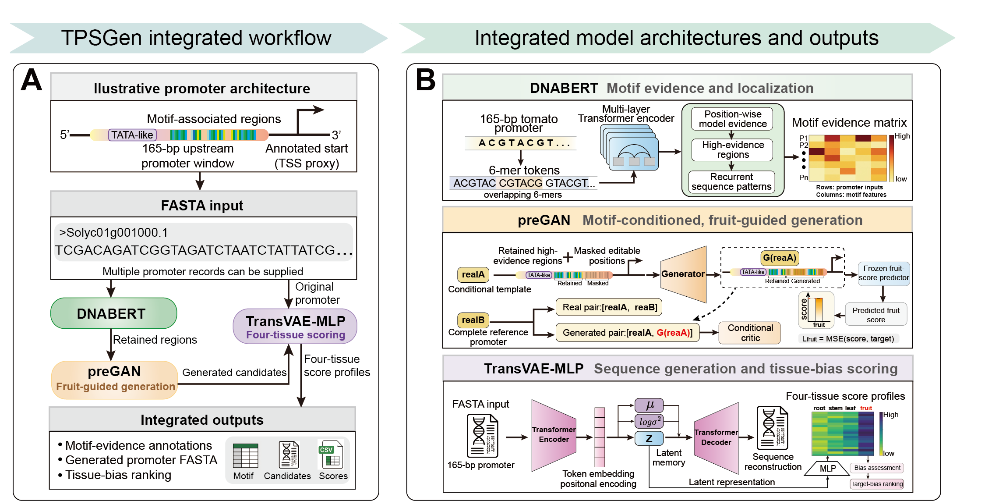

# TPSGen

TPSGen (Tomato Promoter Specificity-guided Generator) is a Python command-line framework for motif-conditioned candidate generation, four-tissue scoring and tissue-bias prioritization of tomato promoters.

It provides a unified workflow for:

- validating promoter FASTA inputs
- annotating a configured promoter motif set
- reporting root, stem, leaf and fruit-associated heuristic scores
- generating motif-aware candidate promoter sequences
- exporting reports and figure-ready result summaries
- running bundled model-backed routes explicitly when needed
- reproducing retained manuscript-facing result resources

TPSGen integrates package-native deterministic modules, bundled model-backed routes, preprocessing logic, design utilities and retained project result tables in one inspectable software framework for the accompanying Application Note.

Some internal module names and command aliases retain `legacy` for backward compatibility with earlier project scripts. In this release, these paths refer to supported model-backed adapters and retained result-reconstruction routes, not deprecated workflows.

## Framework Overview

The figure below summarizes the TPSGen workflow. Tomato promoter FASTA
sequences are processed through motif evidence extraction, motif-conditioned
candidate generation and four-tissue score-based prioritization. The displayed
scores and designed sequences are computational outputs and do not by
themselves establish experimentally validated tissue-specific expression.



*TPSGen framework overview. DNABERT-derived evidence, preGAN fruit-guided
generation and TransVAE-MLP four-tissue scoring are exposed as model-backed
routes, while the default package-native route remains runnable without model
checkpoints.*

## Installation

Install a downloaded release wheel for package-native commands:

```bash
python -m venv .venv
source .venv/bin/activate
pip install tpsgen-0.2.0-py3-none-any.whl
```

The release wheel contains the paper-aligned Transformer-VAE checkpoint, the preGAN expression-constraint
resource, the default training configuration and the example input.
Package-native commands do not require PyTorch. Install the optional model
dependencies before running checkpoint-backed routes. From a published package
index, use:

```bash
pip install "tpsgen[models]"
```

From a local wheel file, use:

```bash
pip install "tpsgen-0.2.0-py3-none-any.whl[models]"
```

For an editable installation from the repository root:

```bash
python -m venv .venv
source .venv/bin/activate
pip install -e .
```

For development:

```bash
pip install -e ".[dev]"
make test
```

For manuscript-facing result reproduction:

```bash
pip install -e ".[reproduce]"
make reproduce-results
```

## Quick Start

The recommended interface is one integrated command. It accepts a multi-sequence
FASTA file and writes motif evidence, designed candidates, original/candidate
scores and a workflow report under one output directory:

```bash
tpsgen run \
  --input examples/demo_input.fasta \
  --target fruit \
  --candidates 3 \
  --seed 42 \
  --output outputs/demo
```

For a masked template and a compatible preGAN generator checkpoint, use the same
`run` entry point with an explicit design backend. This is an explicit model-backed
route and is not the default package-native workflow:

```bash
tpsgen run \
  --input templates.fasta \
  --design-backend pregan \
  --checkpoint models/pregan/generator_checkpoint.pt \
  --target fruit --candidates 5 --seed 42 --output outputs/pregan_workflow
```

The resulting directory contains `motif/motif_annotations.csv`,
`design/designed_candidates.fasta`, `design/candidate_metadata.csv`,
`scoring/original_scores.csv`, `scoring/candidate_scores.csv`,
`scoring/all_sequence_scores.csv`, three SVG result figures,
`reports/workflow_report.json`, `reports/workflow_summary.csv`, the validated
input FASTA and a top-level `manifest.json`.

The integrated scoring CSV files also contain `score_type` and
`scoring_backend`. In the default `run` route, these fields identify the four
values as package-native tissue-associated heuristic scores. They support
candidate ranking; they are not calibrated expression measurements and are not
TransVAE checkpoint outputs.

The top-level `manifest.json` records the tomato-specific backend used for each
stage, its stage input and output, checkpoint status and score definition.
It also records the status of the optional DNABERT, preGAN and TransVAE model
routes. The bundled DNABERT checkpoint supports explicit FASTA inference with
`predict-dnabert`; the separate retained attention resource is only for
historical post-processing and is not used by the default workflow. The bundled
preGAN generator can be run explicitly, but its historical quantitative
reproducibility and biological activity have not been independently validated.
TransVAE is available through the explicit scoring backend described below.

The lower-level `annotate`, `predict` and `design` commands remain available
for users who need to run or inspect one stage separately. The default
integrated command is the supported user-facing workflow; model-specific
commands and manuscript reproduction scripts are maintained as explicit
advanced routes below.

To score both input and generated candidates with the bundled tomato TransVAE
model, select the explicit model backend:

```bash
tpsgen run \
  --input tomato_promoters.fasta \
  --target fruit \
  --candidates 5 \
  --scoring-backend transvae \
  --output outputs/tomato_transvae
```

The integrated `run` command requires exactly 165-bp unambiguous tomato promoter
records, regardless of scoring backend. The lower-level `annotate`, `predict`
and `design` commands can still be used for exploratory inputs of other lengths.

When genomic coordinates are available, promoter FASTA can be prepared
directly from a tomato reference genome and GFF3 annotation:

```bash
tpsgen extract-promoters \
  --genome tomato.fa \
  --annotation tomato.gff3 \
  --output tomato_promoters.fasta
```

The extractor uses `gene` records, retains complete 165-bp windows, and writes
negative-strand windows in promoter-to-gene orientation by reverse
complementing them. Incomplete or ambiguous windows are skipped and counted
in the command summary.

Run the bundled example workflow:

```bash
mkdir -p outputs

tpsgen copy-example \
  --output outputs/demo_input.fasta

tpsgen validate-input \
  --input outputs/demo_input.fasta

tpsgen annotate \
  --input outputs/demo_input.fasta \
  --output outputs/demo_annotate.csv

tpsgen predict \
  --input outputs/demo_input.fasta \
  --output outputs/demo_predict.csv

tpsgen design \
  --input outputs/demo_input.fasta \
  --target fruit \
  --candidates 3 \
  --seed 42 \
  --output outputs/demo_design.csv

tpsgen report \
  --input outputs/demo_design.csv \
  --output outputs/demo_report.json
```

Or run the same demo with:

```bash
make demo
```

## Inputs

The main input is a FASTA file containing one or more promoter sequences. Multi-sequence FASTA files are supported.

Single-sequence example:

```fasta
>promoter_1
ATGCAAAATTTATCG...
```

Multi-sequence example:

```fasta
>promoter_1
ATGCAAAATTTATCG...
>promoter_2
TTTATCAAAAGGCTA...
>promoter_3
CTATTGGGCAAAATA...
```

Validation rules:

- sequence identifiers must be unique
- empty records are rejected
- sequences are normalized to uppercase
- supported symbols are `A`, `C`, `G`, `T`, `N` and `M`

The integrated `run` workflow requires canonical 165-bp unambiguous `A/C/G/T`
sequences because this matches the tomato model input convention. The
lower-level package-native commands can process exploratory sequences of other
lengths.

### Preparing 165-bp TransVAE Inputs

For `predict-transvae`, each FASTA record should match the 165-bp promoter-window convention used for the retained TransVAE training resource. In the original ITAG3.2 preprocessing workflow, tomato genome FASTA and GFF3 annotation resources were parsed, entries annotated as `gene` on the positive strand were retained, and `gene start` was used as an approximate TSS proxy because high-resolution experimental TSS annotations were not available for that resource.

The retained project convention is:

| Training-resource case | 165-bp genomic window | FASTA sequence orientation |
| --- | --- | --- |
| ITAG3.2 positive-strand `gene` entry | 165 bp directly upstream of `gene start`: `[gene_start - 165, gene_start)` | Keep the reference-genome orientation |

For example, if a positive-strand gene starts at position 16,480, the retained convention extracts `[16480 - 165, 16480)`. The final FASTA sequence should contain exactly 165 bases and only `A/C/G/T`.

If users extend the workflow to negative-strand genes, they should extract the corresponding downstream genomic window relative to reference coordinates and reverse-complement it before writing FASTA, so that all sequences are represented in promoter-to-gene orientation. This negative-strand extension is a user-side strand-aware preparation rule; the retained TransVAE training table was built from the positive-strand ITAG3.2 preprocessing convention above. If a gene is too close to a chromosome boundary to provide a full 165-bp window, exclude that record from TransVAE routes rather than padding with `N`. Package-native `annotate`, `predict` and `design` can still be used for non-165-bp exploratory inputs.

## Choosing A Target Tissue

The `design` command uses `--target` to define the desired tissue-associated design objective:

```bash
--target root
--target stem
--target leaf
--target fruit
```

For example, fruit-targeted design:

```bash
tpsgen design \
  --input my_promoters.fasta \
  --target fruit \
  --candidates 5 \
  --seed 42 \
  --output outputs/fruit_design.csv
```

If the input FASTA contains 100 promoters and `--candidates 5` is used, the design table can contain up to 500 candidate rows. Candidates are ranked separately for each input promoter.

## Outputs And How To Use Them

`annotate` writes a motif table:

| Field | Meaning |
| --- | --- |
| `sequence_id` | Input promoter identifier |
| `motif` | Detected motif sequence |
| `start`, `end` | Zero-based motif coordinates |
| `score` | Match score, equal to motif length for exact matching |

`predict` writes a four-tissue scoring table:

| Field | Meaning |
| --- | --- |
| `sequence_id` | Input promoter identifier |
| `sequence` | Normalized promoter sequence |
| `score_root`, `score_stem`, `score_leaf`, `score_fruit` | Tissue-associated heuristic scores |
| `preferred_tissue` | Tissue with the highest score |

The TransVAE scoring command has a route-specific output scale:

| Command | Output definition |
| --- | --- |
| `predict-transvae` | Four tissue model scores using the same `score_root`--`score_fruit` field names; values are not calibrated to the package-native heuristic scale |

`design` writes a candidate table:

| Field | Meaning |
| --- | --- |
| `original_sequence` | Input promoter sequence |
| `designed_sequence` | Designed candidate promoter sequence |
| `target_tissue` | Requested target tissue |
| `candidate_rank` | Rank within candidates for the same input promoter |
| `score_root`, `score_stem`, `score_leaf`, `score_fruit` | Candidate tissue-associated heuristic scores |
| `preserved_motifs` | Motifs protected by the package-native design route |
| `num_mutations` | Number of point differences from the input sequence |
| `passes_qc` | Quality-control flag when available |

Typical use of the design output:

1. Select candidates with high target-tissue score.
2. Prefer candidates with a clear target-tissue margin over non-target tissues.
3. Check that important motifs are preserved.
4. Avoid candidates with unnecessarily high mutation burden.
5. Use the selected `designed_sequence` entries for downstream manual review or experimental validation.

The software prioritizes promoter candidates computationally. Final promoter activity should be validated experimentally.

## Reproduce Manuscript Resources

The small demo verifies installation and command behavior. Manuscript and supplementary figures are based on retained result tables.

Regenerate the retained manuscript-facing result pack:

```bash
make reproduce-results
```

Outputs are written to:

```text
data/results/reproducible_legacy/
```

## Train A Compatible TransVAE Scoring Checkpoint

The repository includes the TransVAE model architecture, training dataset loader and a lightweight training entry point for checkpoint-backed four-tissue scoring. This is provided so the model-backed scoring route is not just a standalone `.pth` file.

Install model/training dependencies before using these routes:

```bash
pip install -e ".[training]"
```

Run a fast smoke test:

```bash
make train-transvae-smoke
```

Run the default training configuration:

```bash
PYTHONPATH=src python scripts/train_transvae.py \
  --config configs/training_transvae.yaml
```

The generated checkpoint uses the same `TransVAEMLP` schema as the released
Transformer-VAE scoring route. Use it for a reproducible local training run,
or use the bundled paper-aligned checkpoint for the retained model results:

```bash
tpsgen predict-transvae \
  --input examples/demo_input.fasta \
  --checkpoint models/transvae/best_val_corr_model.pth \
  --output outputs/transvae_predict.csv
```

Detailed training documentation is available in `docs/training.md`.

## preGAN Training Smoke Test

The repository includes the preGAN training components and a locally trained
generator checkpoint. The smoke test remains available for checking mask
semantics and the conditional generator/discriminator code path:

```bash
make train-pregan-smoke
```

This writes a temporary checkpoint under `tmp/` with metadata marking it as a
training smoke-test artifact. To run the trained generator and score its
candidates with TransVAE:

```bash
tpsgen run-pregan \
  --input templates.fasta \
  --checkpoint models/pregan/generator_checkpoint.pt \
  --candidates 5 --seed 42 --output outputs/pregan_workflow
```

## Supplementary Figures

Submitted supplementary figures are retained under `docs/fig/`, and their
source tables are retained under `data/results/reproducible_legacy/`. Use
`make reproduce-results` to regenerate the manuscript-facing result pack.

## Main Commands

| Command | Purpose |
| --- | --- |
| `copy-example` | Copy the bundled demonstration FASTA to a user-selected path |
| `validate-input` | Validate FASTA records and sequence symbols |
| `annotate` | Scan promoter sequences for configured motif hits |
| `predict` | Generate root, stem, leaf and fruit-associated scores |
| `design` | Generate motif-aware candidate promoters |
| `report` | Build a compact JSON design summary |
| `figures` | Export lightweight figures from result CSV files |
| `model-figures` | Reconstruct retained project model figure bundles |
| `annotate-dnabert` | Run project DNABERT-derived motif post-processing |
| `predict-transvae` | Run the bundled TransVAE four-tissue checkpoint adapter |

`annotate-dnabert` converts matched precomputed DNABERT sequence and attention
arrays into motif summaries. It is distinct from `predict-dnabert`, which runs
the bundled fine-tuned checkpoint on new 165-bp FASTA records.

Validate a retained DNABERT resource pair before using it:

```bash
tpsgen validate-dnabert \
  --dev-tsv data/raw/dnabert/dev.tsv \
  --atten-npy data/raw/dnabert/atten.npy
```

This checks row counts, reconstructed sequence length and class counts; it does
not establish tomato species provenance.

The retained TransVAE checkpoint is exposed for four-tissue scoring through
`predict-transvae`; released candidate generation is provided by the
package-native `design` command. TransVAE latent-space candidate generation is
not exposed as a public command in this release.

## Repository Layout

```text
TPSGen/
├── src/tomato_promoter_designer/   # package source and CLI
├── examples/                       # runnable FASTA examples
├── data/                           # curated data and retained result resources
├── docs/                           # tool documentation and manuscript sources
├── models/                         # bundled lightweight checkpoints and model manifest
├── scripts/                        # data and result reproduction scripts
└── tests/                          # unit and regression tests
```

Local command outputs are written to `outputs/` in the examples above. That
directory is ignored by git and is not a canonical repository data location.

## Documentation

Detailed tool documentation:

```text
docs/tool_documentation.md
docs/training.md
```

Manuscript sources:

```text
docs/application_note_submission.tex
docs/application_note_supplement.tex
docs/application_note_references.bib
```

## Data And Model Boundary

Package-native commands run after installation without loading a checkpoint.
The repository and release wheel also bundle the paper-aligned Transformer-VAE checkpoint
and the preGAN expression-constraint resource:

```text
models/transvae/best_val_corr_model.pth
models/pregan_expression/165_mpra_expr_denselstm.pth
models/pregan_expression/SeqRegressionModel.py
models/weights_manifest.json
```

The TransVAE route includes compatible training code in this repository. The
preGAN route includes tested training components for mask-preserving conditional
generation and uses the bundled expression-constraint resource internally during
the smoke test. The bundled preGAN generator is runnable through the explicit
generation commands, but it is not presented as an independently benchmarked or
experimentally validated generator. DNABERT has both an explicit inference route
and a separate post-processing route for precomputed attention inputs. These
routes therefore have different reproduction boundaries.

Large genomes, HDF5 corpora, BLAST databases and optional external resources are tracked through manifests rather than bundled into normal git history.

See `docs/tool_documentation.md` for data, model and reproduction details.

## Citation

Citation metadata is provided in `CITATION.cff`. Please cite the Application Note and repository release when using TPSGen.

## License

The package code is released under the MIT license declared in `LICENSE` and
`pyproject.toml`. Project data, checkpoints, derived resources and third-party
attribution boundaries are documented in `RESOURCE_LICENSES.md` and
`data/source_registry.tsv`.
