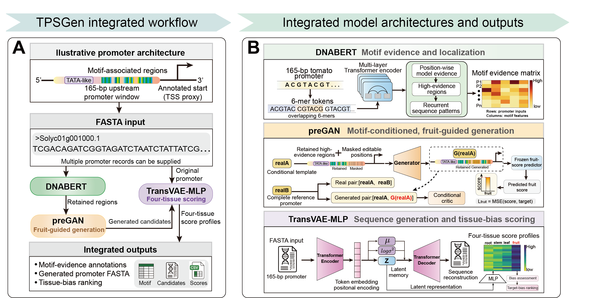

# TPSGen

TPSGen (Tomato Promoter Specificity-guided Generator) is a Python command-line toolkit for evidence-guided generation and four-tissue computational prioritization of tomato promoter candidates.

The model-backed workflow connects three project modules in one traceable route:

```text
165-bp tomato promoter FASTA
  -> DNABERT position-associated evidence
  -> retained-position masked template
  -> preGAN candidate generation
  -> TransVAE-MLP root/stem/leaf/fruit scoring
  -> tissue-bias filtering and candidate ranking
```

TPSGen writes intermediate evidence, templates, generated sequences, four-tissue scores and run metadata so that every ranked candidate can be traced to its input promoter. Scores are computational prioritization outputs; experimental validation is required before making biological claims.

## Framework Overview



*DNABERT-derived evidence identifies positions to retain, preGAN completes editable positions under fruit-associated guidance, and TransVAE-MLP compares candidates across root, stem, leaf and fruit targets.*

## Main Features

- validates single- or multi-record promoter FASTA input;
- runs fresh inference with the bundled tomato DNABERT 6-mer model;
- converts DNABERT evidence into retained-position preGAN templates;
- generates candidates with the bundled 10,000-iteration preGAN checkpoint;
- scores candidates with the bundled four-output TransVAE-MLP model;
- reports preferred tissue, target score, target-bias margin and tissue-bias index (`tau`);
- distinguishes strict-threshold results from adaptive target-biased results;
- checks sequence quality and retained-position fidelity;
- provides deterministic package-native commands for lightweight demonstrations;
- includes training entry points, model metadata, checksums, examples and tests.

## Requirements

- Python 3.9 or newer
- Linux recommended for model-backed execution
- PyTorch 2.0 or newer for TransVAE and preGAN
- Hugging Face Transformers 4.x for DNABERT
- CUDA-capable GPU recommended for training; inference can run on CPU

## Installation

### From the repository

```bash
git clone <TPSGen repository URL>
cd TPSGen

python -m venv .venv
source .venv/bin/activate
python -m pip install --upgrade pip
python -m pip install -e ".[dnabert]"
```

For training and development utilities:

```bash
python -m pip install -e ".[dnabert,training,dev,reproduce]"
```

### From a release wheel

```bash
python -m venv .venv
source .venv/bin/activate
python -m pip install --upgrade pip
python -m pip install "tpsgen-0.2.0-py3-none-any.whl[dnabert]"
```

The complete wheel includes the bundled DNABERT, preGAN and TransVAE resources and is therefore large. A repository installation can instead use `TPSGEN_MODELS_DIR` to point to a separately distributed `models/` directory.

## Verify The Installation

```bash
tpsgen --help
tpsgen validate-models
tpsgen validate-input --input examples/demo_input.fasta
```

For a complete model-backed installation, `validate-models` should report the DNABERT checkpoint, preGAN generator and TransVAE checkpoint as available.

## Quick Start: Complete Model-Backed Workflow

This command follows the integrated manuscript logic. Input records must be unique, unambiguous 165-bp A/C/G/T promoter sequences.

```bash
tpsgen run \
  --input examples/demo_input.fasta \
  --target fruit \
  --motif-backend dnabert \
  --design-backend pregan \
  --checkpoint models/pregan/original_pregan_10000.pt \
  --candidates 8 \
  --seed 42 \
  --output outputs/fruit_design
```

This route:

1. runs DNABERT and derives position-associated evidence;
2. retains high-evidence positions and marks other positions editable;
3. passes the resulting masked template to preGAN;
4. scores every candidate with TransVAE-MLP;
5. filters by QC, retained positions, preferred tissue, target margin and `tau`;
6. ranks eligible candidates separately for each input promoter.

The workflow automatically uses the default TransVAE checkpoint. In this command, `--checkpoint` identifies the preGAN generator.

## Quick Start: Existing Masked Templates

If you already have 165-character templates in which retained bases are A/C/G/T and editable positions are `M`:

```bash
tpsgen run-pregan \
  --input templates.fasta \
  --checkpoint models/pregan/original_pregan_10000.pt \
  --target fruit \
  --candidates 8 \
  --min-margin 0.0 \
  --min-tau 0.7 \
  --adaptive-tau-floor 0.05 \
  --seed 42 \
  --output outputs/masked_template_run
```

`run-pregan` treats supplied A/C/G/T positions as retained positions. It does not run DNABERT; use the integrated command above for automatic DNABERT-to-template transfer. Add `--strict-tau` to disable adaptive fallback.

## Lightweight Package-Native Demo

The deterministic route checks installation, file formats and report generation without loading neural checkpoints:

```bash
tpsgen run \
  --input examples/demo_input.fasta \
  --target fruit \
  --candidates 3 \
  --seed 42 \
  --output outputs/demo
```

Alternatively:

```bash
make demo
```

Package-native scores are heuristic scores. They are not TransVAE outputs and should not be compared numerically with TransVAE model scores.

## Input Format

```fasta
>promoter_1
ACGTT...165_BASES_TOTAL...TTGCA
>promoter_2
TTAAA...165_BASES_TOTAL...CGTAT
```

Integrated-route requirements:

- unique sequence identifiers;
- exactly 165 nucleotides per record;
- only unambiguous `A`, `C`, `G` and `T`;
- incomplete promoter windows excluded rather than padded with `N`;
- masked-template commands additionally accept `M` at editable positions.

### Extract promoters from a genome

```bash
tpsgen extract-promoters \
  --genome tomato_genome.fa \
  --annotation tomato_annotation.gff3 \
  --output tomato_promoters.fasta
```

The extractor uses annotated gene starts as coordinate proxies, retains complete 165-bp windows and reverse-complements negative-strand windows into promoter-to-gene orientation. It reports skipped incomplete, ambiguous or duplicate records.

## Output Directory

The model-backed workflow writes:

| File | Contents |
| --- | --- |
| `pregan_masked_templates.csv` | Source sequence, generated template and retained positions |
| `dnabert_attention_evidence.csv` | DNABERT prediction and evidence when DNABERT is selected |
| `pregan_candidates.csv` | Generated sequences, QC, retention, scores and ranks |
| `pregan_candidates.fasta` | Generated candidate sequences |
| `transvae_candidate_scores.csv` | Four TransVAE scores for every candidate |
| `manifest.json` | Backends, thresholds, information flow, seed and output paths |

Important candidate fields:

| Field | Meaning |
| --- | --- |
| `score_root`, `score_stem`, `score_leaf`, `score_fruit` | Four checkpoint-specific tissue-associated scores |
| `preferred_tissue` | Tissue with the largest transformed score |
| `target_score` | Score for the requested tissue |
| `target_margin` | Target score minus the strongest non-target score |
| `tau` | Concentration of the four-score profile |
| `passes_qc` | Sequence-quality result |
| `passes_retained_positions` | Whether conditioned positions were preserved |
| `eligible_for_ranking` | Whether active ranking requirements were met |
| `final_rank` | Rank within the corresponding input promoter |
| `threshold_mode` | `paper_strict` or `adaptive_target_biased` |
| `specificity_level` | `strong`, `target_biased` or `not_eligible` |

`tau` does not identify the favored tissue by itself. Interpret it together with `preferred_tissue` and `target_margin`.

## Run Individual Modules

### DNABERT inference

```bash
tpsgen predict-dnabert \
  --input tomato_promoters.fasta \
  --output outputs/dnabert_predictions.csv
```

### TransVAE scoring

```bash
tpsgen predict-transvae \
  --input tomato_promoters.fasta \
  --output outputs/transvae_scores.csv
```

To select another compatible checkpoint:

```bash
tpsgen predict-transvae \
  --input tomato_promoters.fasta \
  --checkpoint models/transvae/full_length_joint_model.pth \
  --output outputs/full_length_scores.csv
```

### preGAN generation only

```bash
tpsgen pregan-generate \
  --input templates.fasta \
  --checkpoint models/pregan/original_pregan_10000.pt \
  --candidates 8 \
  --seed 42 \
  --output outputs/pregan_candidates.csv \
  --fasta-output outputs/pregan_candidates.fasta
```

### Package-native stage commands

```bash
tpsgen annotate --input examples/demo_input.fasta --output outputs/motifs.csv
tpsgen predict --input examples/demo_input.fasta --output outputs/native_scores.csv
tpsgen design --input examples/demo_input.fasta --target fruit --candidates 3 --seed 42 --output outputs/native_designs.csv
tpsgen report --input outputs/native_designs.csv --output outputs/native_report.json
```

## Choosing A Target Tissue

Supported targets are `root`, `stem`, `leaf` and `fruit`.

The requested tissue must be the highest-scoring tissue before a candidate passes model-backed tissue-bias filtering. A positive `target_margin` means the target exceeds all three non-target scores.

The default `tau` threshold is `0.7`. If no candidate reaches it, the default workflow may lower the effective threshold to the adaptive floor while retaining target-highest and margin requirements. Such candidates are labelled `adaptive_target_biased`/`target_biased`, not strict results.

## Bundled Models

| Module | Resource | Role |
| --- | --- | --- |
| DNABERT | `models/dnabert/pytorch_model.bin` | Fresh tomato 6-mer evidence inference |
| preGAN | `models/pregan/original_pregan_10000.pt` | Conditional candidate generation |
| preGAN expression predictor | `models/pregan_expression/165_mpra_expr_denselstm.pth` | Frozen fruit-associated training guidance |
| TransVAE-MLP | `models/transvae/historical_compatible_best_val_corr.pth` | Default four-tissue scoring |
| Full-length TransVAE-MLP | `models/transvae/full_length_joint_model.pth` | Corrected full-length development checkpoint |

Checksums and metadata are recorded in [`models/weights_manifest.json`](models/weights_manifest.json). Run `tpsgen validate-models` before model-backed analysis.

The default TransVAE scorer preserves the input convention required by its checkpoint. The separate full-length checkpoint uses all 165 positions and does not alias nucleotide A to padding. Results from these checkpoints should not be mixed.

Checkpoint outputs are mapped to non-negative values with `softplus` before `tau` calculation. `tau` accepts only finite, non-negative values with a positive maximum.

## Training

Standard users do not need to retrain bundled models.

### Train TransVAE

```bash
CUDA_VISIBLE_DEVICES=0 \
PYTORCH_CUDA_ALLOC_CONF=expandable_segments:True \
PYTHONPATH=src \
python scripts/train_transvae.py \
  --config configs/training_transvae.yaml \
  --input-csv data/raw/transvae/paper_split/train.csv \
  --validation-csv data/raw/transvae/paper_split/validation.csv \
  --output-checkpoint models/transvae/new_joint_model.pth \
  --metrics-json models/transvae/new_joint_metrics.json \
  --epochs 40 \
  --batch-size 128 \
  --learning-rate 0.0003 \
  --target-tissue fruit \
  --specificity-mode label-gated \
  --specificity-weight 0.3 \
  --specificity-margin 0.2 \
  --device cuda
```

### Train preGAN

```bash
CUDA_VISIBLE_DEVICES=0 \
PYTORCH_CUDA_ALLOC_CONF=expandable_segments:True \
PYTHONPATH=src \
python scripts/train_pregan.py \
  --input-csv data/raw/pregan/paper_split/train.csv \
  --output-checkpoint models/pregan/new_generator_10000.pt \
  --metrics-json models/pregan/new_generator_10000.json \
  --steps 10000 \
  --batch-size 32 \
  --critic-updates 5 \
  --checkpoint-interval 100 \
  --snapshot-dir models/pregan/new_snapshots_10000 \
  --device cuda \
  --expression-checkpoint models/pregan_expression/165_mpra_expr_denselstm.pth \
  --expression-module-dir models/pregan_expression
```

See [`docs/training.md`](docs/training.md) and [`docs/tool_documentation.md`](docs/tool_documentation.md) for additional details.

## Testing

```bash
PYTHONPATH=src python -m unittest discover -s tests -v
```

or:

```bash
make test
```

## Troubleshooting

### A model cannot be found

```bash
tpsgen validate-models
export TPSGEN_MODELS_DIR=/absolute/path/to/TPSGen/models
```

### Check CUDA

```bash
python - <<'PY'
import torch
print(torch.__version__)
print(torch.cuda.is_available())
print(torch.cuda.device_count())
PY
```

### Input is rejected

```bash
tpsgen validate-input --input your_sequences.fasta
```

For model-backed routes, verify that every record is exactly 165 bp and contains only A/C/G/T. User-supplied preGAN templates may contain `M`.

### No candidate passes `tau >= 0.7`

This does not mean execution failed. Inspect `preferred_tissue`, `target_margin`, `tau`, `threshold_mode` and `specificity_level`. The adaptive route can return explicitly labelled target-biased candidates; `--strict-tau` disables that behavior.

## Repository Layout

```text
TPSGen/
|-- configs/       Training configuration
|-- data/          Input tables and retained result resources
|-- docs/          Manuscript and documentation
|-- examples/      Bundled FASTA example
|-- models/        DNABERT, preGAN and TransVAE resources
|-- scripts/       Training and reproducibility entry points
|-- src/tpsgen/    Installable Python package
`-- tests/         Unit and integration tests
```

## Reproducibility

For each analysis, retain:

- TPSGen version and complete command;
- input FASTA and checksum;
- selected backend names;
- model checkpoint checksums;
- random seed and candidate count;
- requested and effective thresholds;
- generated CSV/FASTA files and `manifest.json`.

## Documentation

- [`docs/tool_documentation.md`](docs/tool_documentation.md): workflow and output definitions
- [`docs/training.md`](docs/training.md): TransVAE training procedure
- [`models/README.md`](models/README.md): bundled model inventory
- [`models/weights_manifest.json`](models/weights_manifest.json): checksums and metadata

## Citation

Citation metadata are provided in [`CITATION.cff`](CITATION.cff). Cite TPSGen and the relevant DNABERT, preGAN and TransVAE methods when using model-backed routes.

## License

Software licensing is described in [`LICENSE`](LICENSE). Model and data-resource terms are documented in [`RESOURCE_LICENSES.md`](RESOURCE_LICENSES.md).
